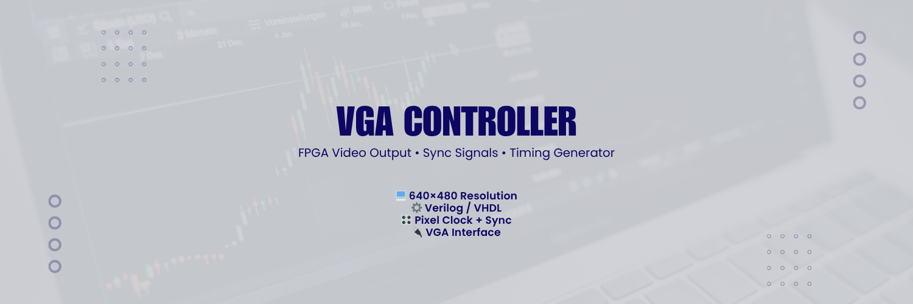

# VGA Controller

An FPGA-based VGA controller implementation that generates video output for displays, supporting custom resolutions and pixel formats.

<p align="center">
  
</p>

---

## 🚀 Project Overview

This project builds a VGA controller module using (specify your hardware/FPGA, e.g., Xilinx Verilog or VHDL) to drive display output via the VGA interface. It covers sync signals, pixel timing, resolution support, and color output.

---

## 🧩 Key Features

| Feature             | Description                                         |
|----------------------|-----------------------------------------------------|
| Custom resolution    | Supports (e.g.) 640×480, 800×600, 1024×768          |
| Color depth support  | Handles RGB outputs with configurable depth         |
| FPGA ready           | Synthesizable code for (specify board)              |
| Modular architecture | Easy to adapt for different display controllers     |

---

## 🛠 Tech Stack & Tools

- **Hardware description language**: Verilog or VHDL  
- **Platform**: (e.g.) Xilinx Spartan-6 / Artix-7 / Intel Cyclone  
- **Toolchain**: Vivado / Quartus / ISE  
- **Testbench**: (If you have) Simulation via ModelSim or built-in test benches  
- **Demo**: (If applicable) On-board VGA connector to monitor  

---

## 🧪 Setup & Usage

1. Clone repository:  
   ```bash
   git clone https://github.com/vjadon09/VGA-Controller.git
   cd VGA-Controller
